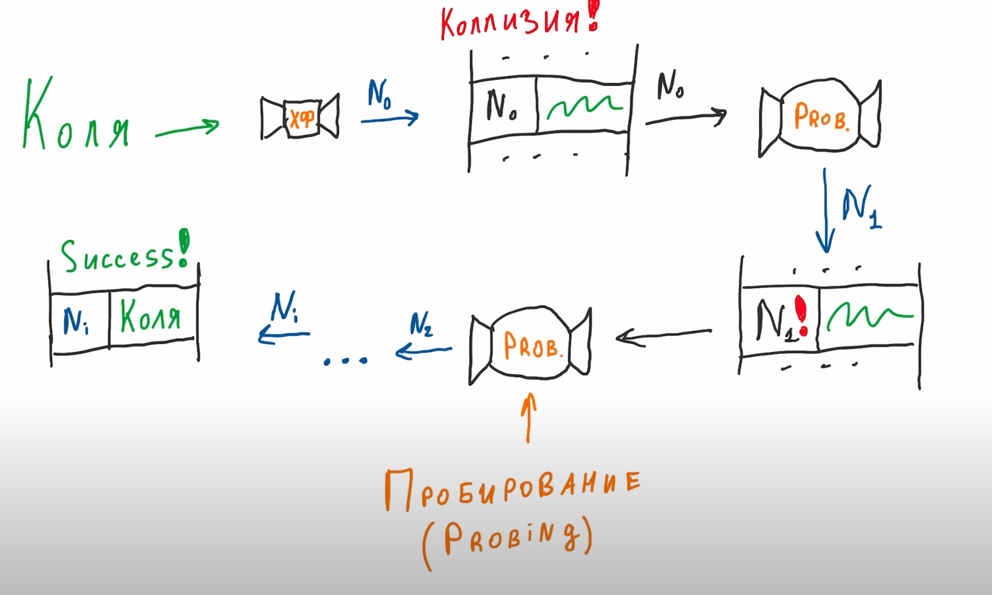

https://www.youtube.com/watch?v=P_SXTUiA-9Y

- Набор в мапе делится на бакеты для поиска с постоянным временем
    - распределяется равномерно
    - постояннен в поиске
    - детерминированность - для этого и того же ключа один и тот же хеш
    - криптоустойчивость - наша хеш функция не должна позволять данным попадать в один и тот зе бакет

- ключи, это хеш-функция

### Сигнатура получения значения в GO для мапы

Но при работе с мапами, ни дженерики, ни интерфейсы не используются

### Операции при работе с мапами
- Все операции выполняются с помощью **unsafe.pointers** (ячейка памяти, на который указывает такой указатель может относиться к любому типу данных)
- Но чтобы понять с чем мы работаем, используется **type descriptor**
- type descriptor предоставляет операции **hash, equal, copy** (для разных типов хеш-функция будет отличаться, так же методы сравнения и копирования)

  
### Как скомпилируется

Происходит **разименование** - сначала unsafe.Pointer приводится к искомому типу, и от него берется значение

### Header в Map

Количество бакетов в мапе хранится в хидере в виде логарифма. 
Hash seed для обеспечения условий крипто-безопасности, которые предъявляли ранее. 
LOB - указатель на младший бик хеша для каждой бакета.

### Что такое Low bits pointer 

Есть ключ, к нему применяется хеш-функция, на выходе число
Число может быть большим. 
Как понимать, в какой бакет положить данные? Делается остаток от деления на количество бакетов: 

Все это вычисляется в двоичном виде. Чтобы тут получить остаток от деления,нам нужно log (который хранится в заголовке мапы) от количества бакетов: 

И остатку от деления будут соответствовать два бита младшего бакета:

После присвоения младшего бита (номера бакета) приравниваем его к LOB

### Структура бакета
В каждом бакете аналогичная структура. Состоит из двух частей:
- 8 слотов для старших битов хеша. Процедура получения такая же как и для младших битов
- если слот нашелся, то уже сравнивается каждый ключ

В каждом бакете не может храниться **более 8 значений**
Формат хранения ключей/значений оптимизировано для выравнивания типов: 

### Получение битовой маски

### Переполнение бакетов

Нужно избегать переполнений, так как вычисления становятся сложнее. 
Алгоритм выделения новой памяти под бакеты определяется отдельным алгоритмом и в тот момент, когда процент заполнения 20% (loadFactory 6.5)
При выделении памяти происходит эвакуация данных из бакетов

Операции работы с мапой будут работать медленнее, так как надо смотреть в нескольких местах

Поэтому нужно заранее аллоцировать память под нужный размер мапы

### Почему нельзя взять указатель на значение мапы по ключу?
Потому что при переполнении мапы может произойти эвакуация данных из бакета и ссылка станет не актуальной. 

### Рандомный порядом обхода
При обходе значений мапы - получаем всегда рандомный порядок. 
Итератор ходит и по новым и по старым бакетам и если происходит эвакуация бакета, то порядом меняется. 
При каждом выводе мапы мы видим, что ключи отсортированы

Мапа сортируется в самой Println

### Что такие хеш-таблицы

Это получение id  для ключа с помощью хеш-функции.

### Стратегии решения коллизий
1.Метод открытой адресации 
1.1. Множественное вычисление функции их полученного ключа. **Линейное пробирование**. Числа, которые мы получаем - последовательность проб.

   
Минуст такого подхода, что при удалении полей, поиск по такой таблице будет работать медленно, потому что приходится пропускать много ячеек

Рехеширование помогает создавать новую тублицу, удаляя помеченные на удаление записи

1.2. Квадратичное пробирование
1.3. Двойное хеширование

2. Метод цепочек
В таблицу сохраняется не сами значения, а ссылка на другую область памяти

   
в случае коллизии мы не ищем новую ячейку, а ссылку на новую запись хранит сама маша:

При поиске переходим по ссылкам:

   

### Правила хеш-функции

