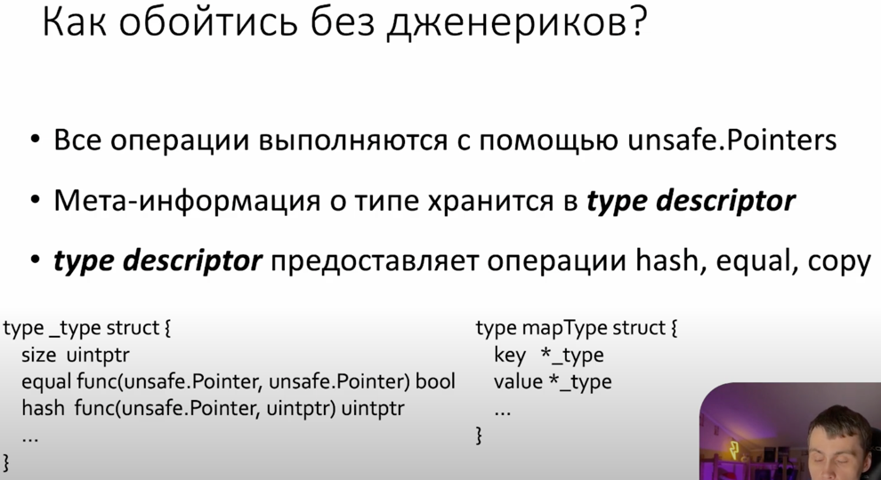
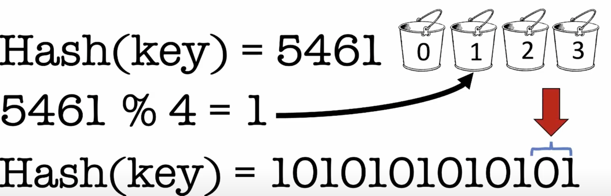

https://www.youtube.com/watch?v=P_SXTUiA-9Y

- Набор в мапе делится на бакеты для поиска с постоянным временем
    - распределяется равномерно
    - постояннен в поиске
    - детерминированность - для этого и того же ключа один и тот же хеш
    - криптоустойчивость - наша хеш функция не должна позволять данным попадать в один и тот зе бакет

- ключи, это хеш-функция

### Сигнатура получения значения в GO для мапы

Но при работе с мапами, ни дженерики, ни интерфейсы не используются

### Операции при работе с мапами
- Все операции выполняются с помощью **unsafe.pointers** (ячейка памяти, на который указывает такой указатель может относиться к любому типу данных)
- Но чтобы понять с чем мы работаем, используется **type descriptor**
- type descriptor предоставляет операции **hash, equal, copy** (для разных типов хеш-функция будет отличаться, так же методы сравнения и копирования)

  
### Как скомпилируется

Происходит **разименование** - сначала unsafe.Pointer приводится к искомому типу, и от него берется значение

### Header в Map

Количество бакетов в мапе хранится в хидере в виде логарифма. 
Hash seed для обеспечения условий крипто-безопасности, которые предъявляли ранее. 
LOB - указатель на младший бик хеша для каждой бакета.

### Что такое Low bits pointer 

Есть ключ, к нему применяется хеш-функция, на выходе число
Число может быть большим. 
Как понимать, в какой бакет положить данные? Делается остаток от деления на количество бакетов: 

Все это вычисляется в двоичном виде. Чтобы тут получить остаток от деления,нам нужно log (который хранится в заголовке мапы) от количества бакетов: 

И остатку от деления будут соответствовать два бита младшего бакета:

После присвоения младшего бита (номера бакета) приравниваем его к LOB

### Структура бакета
В каждом бакете аналогичная структура. Состоит из двух частей:
- 8 слотов для старших битов хеша. Процедура получения такая же как и для младших битов
- если слот нашелся, то уже сравнивается каждый ключ

В каждом бакете не может храниться **более 8 значений**
Формат хранения ключей/значений оптимизировано для выравнивания типов: 

### Получение битовой маски

### Переполнение бакетов

