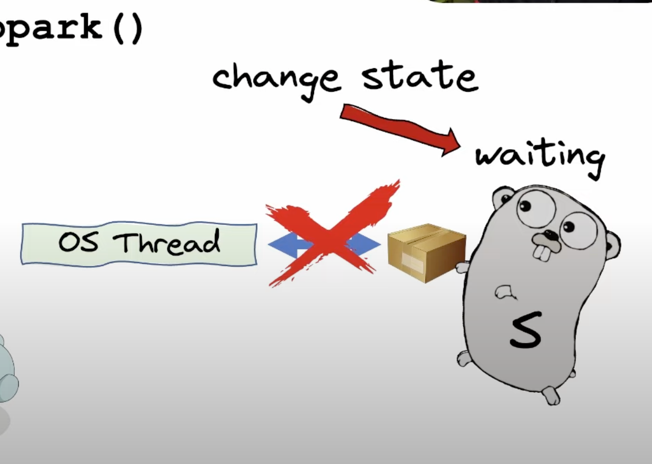
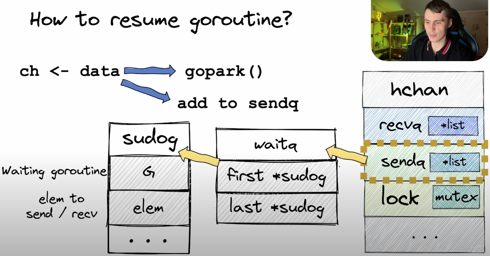
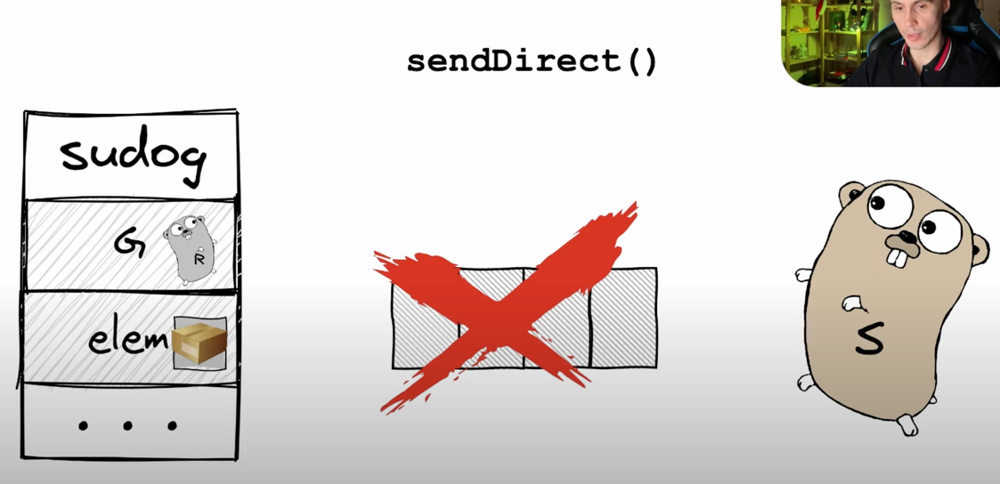

1. Представляет из себя структуру с набором параметров
   

   - qcount - количество элементов в буфере
   - dataqsize - размерность буфера
   - buf - указатель на сам буфер
   - closed - флаг, закрыт ли канал. Используется тип 32 бита, потому что при работе с этим параметров используются атомики. Т.е. состояние изменяется не блокируя сам канал.
   - recvq и sendq - связанный список горутин, который ожидают чтение или запись из канала
   - recvx и sendx - номера ячеек буфера из которых происходит чтение/запись
   - lock - это Mutex
2. Буффер, это циклическая очередь

3. При записи в буферизированный канал указатель sendx смещает позицию

4. При чтении смещается соответсвующий индекс,

   

5. При отправке в буферизированный канал созздается лок и создается копия данных, помещается в ячейку

6. После этого разблокируется mutex. После чего с ним может работать другая горутина. 

7. При чтении прозойдет все тоже самое:  
- блокировка мьютекса
- копирование данных ресиверу 
- разблокировка мьютекса

8. При наполнении канал ставит горутину на паузу: 

9. Посмотрим как это происходит: 
- параллельно работают не горутины и потоки OS

- Все горутины выстраиваются в очереди в рамках потоков

- последовательно выполняются горутины и между ними переключается контекст
10. При записи в канал: 
- канал вызывает функцю gopark()
- которая обращается к шедулеру, который менет статус горутины с running на waiting

- после этого разрыавается связь горутины с тредом

- если в runqueue есть ожидающая горутина, то планировщик переключает контекст треда на другую горутину

11. Когда проиходит парковка горутины, помимо этого происходит следующие дейстивя: 
- горутина попадает в очередь sendq
- это очередь есть у каждого канала 
- он представляет из себя ссылку на структуру waitq, которая хранит у себя указатели на начало и конец связанного списка
- список представлет из себя структуру sudog
- параметр G представлет из себя ту самую спящую горутину
- elem - это тот элемент, который мы отправляем

- итак горутина и данные у нас помещены в sudog и лежат ам пока не придет ридер

12. Первым делом ридер забирает элемент из очереди 

- видно что в буфере появилась свободная ячейка и наша спящая горутина может проснуться
- ресивер идет и проверяет, а есть ли в очереди sendq свящие горутины?

- ресивер возьмет элемент из подвисшей очереди и положит его в буфер 

- и третьим шагом ресивер возьмется за пробуждение горутны
- ресивер вызывает goready  и меняется состояние спящей горутины на runnable

- получается, что лок происхоит один раз и канал начинает быть доступен на запись как кто-то читает из него элемент

13. В случае, если sender отправляет элемент и в этот момент есть горутина с Reader, которая ждет на парковке, то происходит оптимизация - Sender сразу отправляет sudoG структуру Readerа этот элемента

14. В небуферизированных каналах такая оптимизация используется напрямую

15. Итог

16. При дебаге видно что из себя представляет структура chan
