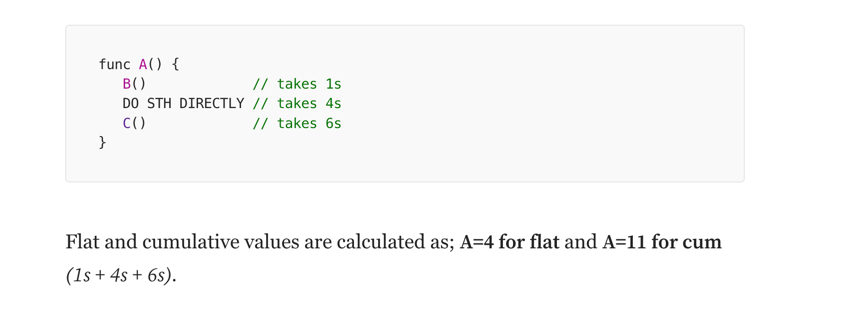
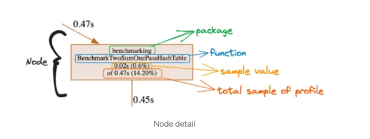
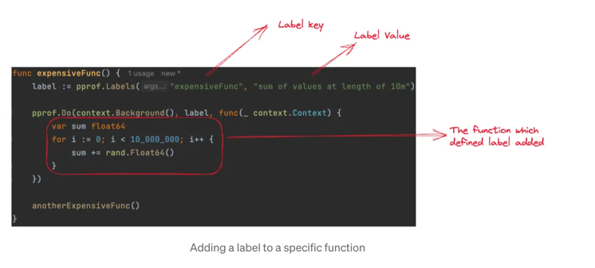
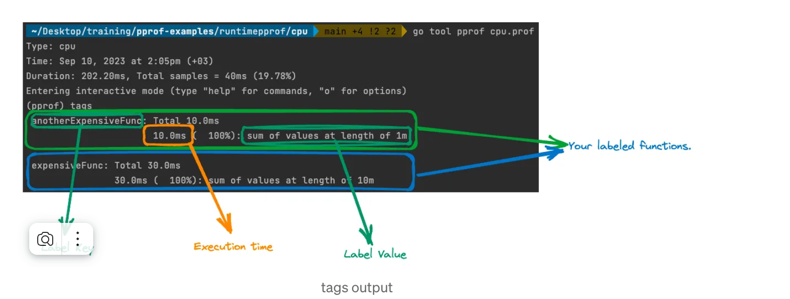

Запустить профилирование по процу и памяти
```shell
go test -bench='.' -cpuprofile='cpu.prof' -memprofile='mem.prof'

go test -bench='.' -cpuprofile='cpu.prof' -memprofile='mem.prof'

goos: darwin
goarch: arm64
pkg: github.com/triumphpc/go-study/tricks/profiling/full_manual/cpu
cpu: Apple M1 Pro
BenchmarkTwoSum/small_slice-10        	78010725	        15.16 ns/op
BenchmarkTwoSum/medium_slice-10       	29965632	        39.88 ns/op
BenchmarkTwoSum/large_slice-10        	    4716	    253798 ns/op
BenchmarkTwoSumHashTable/small_slice-10         	23362874	        51.12 ns/op
BenchmarkTwoSumHashTable/medium_slice-10        	 3182900	       545.2 ns/op
BenchmarkTwoSumHashTable/large_slice-10         	   15285	     82375 ns/op
BenchmarkTwoSumOnePassHashTable/small_slice-10  	36091446	        36.58 ns/op
BenchmarkTwoSumOnePassHashTable/medium_slice-10 	 3535705	       328.4 ns/op
BenchmarkTwoSumOnePassHashTable/large_slice-10  	   23356	     60630 ns/op
BenchmarkTwoMy/small_slice-10                   	41214072	        30.34 ns/op
BenchmarkTwoMy/medium_slice-10                  	 3540582	       355.2 ns/op
BenchmarkTwoMy/large_slice-10                   	   23587	     52724 ns/op
PASS
ok  	github.com/triumphpc/go-study/tricks/profiling/full_manual/cpu	19.841s
```

Далее запускаем анализ с помощью pprof
```shell
go tool pprof cpu.prof

File: cpu.test
Type: cpu (тип профилирования)
Time: Jan 11, 2025 at 2:48pm (MSK)
Duration: 19.53s (сколько всего времени заняло), Total samples = 18.60s (95.25%)
Entering interactive mode (type "help" for commands, "o" for options)
(pprof) 

```

Посмотреть TOP15 самых ресурсоемких функция

```shell
File: cpu.test
Type: cpu
Time: Jan 11, 2025 at 2:48pm (MSK)
Duration: 19.53s, Total samples = 18.60s (95.25%)
Entering interactive mode (type "help" for commands, "o" for options)
(pprof) top15
Showing nodes accounting for 15.92s, 85.59% of 18.60s total
Dropped 136 nodes (cum <= 0.09s)
Showing top 15 nodes out of 92
      flat  flat%   sum%        cum   cum%
     6.85s 36.83% 36.83%      6.85s 36.83%  runtime.kevent
     1.47s  7.90% 44.73%      1.52s  8.17%  github.com/triumphpc/go-study/tricks/profiling/full_manual/cpu.twoSum
     1.14s  6.13% 50.86%      2.51s 13.49%  runtime.mapassign_fast64
     1.12s  6.02% 56.88%      1.12s  6.02%  runtime.madvise
     0.84s  4.52% 61.40%      1.73s  9.30%  runtime.mallocgc
     0.83s  4.46% 65.86%      0.83s  4.46%  runtime.pthread_kill
     0.74s  3.98% 69.84%      0.74s  3.98%  runtime.pthread_cond_wait
     0.59s  3.17% 73.01%      0.70s  3.76%  runtime.mapaccess2_fast64
     0.51s  2.74% 75.75%      0.51s  2.74%  runtime.usleep
     0.49s  2.63% 78.39%      0.49s  2.63%  runtime.pthread_cond_signal
     0.37s  1.99% 80.38%      0.67s  3.60%  runtime.evacuate_fast64
     0.31s  1.67% 82.04%      2.46s 13.23%  github.com/triumphpc/go-study/tricks/profiling/full_manual/cpu.twoSumOnePassHashTable
     0.25s  1.34% 83.39%      0.25s  1.34%  runtime.pthread_cond_timedwait_relative_np
     0.23s  1.24% 84.62%      0.23s  1.24%  runtime.memclrNoHeapPointers
     0.18s  0.97% 85.59%      0.18s  0.97%  internal/chacha8rand.block
     
```

```text
Давайте разберем эти метрики:
flat - показывает время, затраченное непосредственно в этой функции (исключая время в функциях, которые она вызывает)
flat% - процент от общего времени профилирования для flat
sum% - накопительная сумма процентов (flat%) сверху вниз
cum - кумулятивное время, включающее время выполнения как самой функции, так и всех функций, которые она вызывает
cum% - процент от общего времени для cum
Пример разбора:
text1.47s  7.90% 44.73%      1.52s  8.17%  github.com/.../cpu.twoSum

1.47s (flat) - функция twoSum сама по себе заняла 1.47 секунды
7.90% (flat%) - это 7.90% от общего времени профилирования
44.73% (sum%) - сумма всех предыдущих flat% включая текущий
1.52s (cum) - общее время включая вызовы других функций
8.17% (cum%) - процент от общего времени включая вызовы

Как интерпретировать:

Самые "тяжелые" места видны по высоким значениям flat и cum
Большая разница между flat и cum означает, что функция тратит много времени на вызовы других функций
Высокий flat указывает на "горячие" места, которые стоит оптимизировать первыми

В вашем случае:

runtime.kevent занимает больше всего времени (36.83%)
twoSum и twoSumOnePassHashTable - ваши основные функции, занимающие ~8% и ~13% времени соответственно
Заметная часть времени уходит на работу с памятью (mallocgc, mapassign_fast64)
```



Вывод только cum и полный путь до метода 
```shell
go tool pprof cpu.prof
File: cpu.test
Type: cpu
Time: Jan 11, 2025 at 2:48pm (MSK)
Duration: 19.53s, Total samples = 18.60s (95.25%)
Entering interactive mode (type "help" for commands, "o" for options)
(pprof) granularity=lines
(pprof) top15
Showing nodes accounting for 13.09s, 70.38% of 18.60s total
Dropped 348 nodes (cum <= 0.09s)
Showing top 15 nodes out of 112
      flat  flat%   sum%        cum   cum%
     6.85s 36.83% 36.83%      6.85s 36.83%  runtime.kevent /opt/homebrew/Cellar/go/1.23.4/libexec/src/runtime/sys_darwin.go:498
     1.12s  6.02% 42.85%      1.12s  6.02%  runtime.madvise /opt/homebrew/Cellar/go/1.23.4/libexec/src/runtime/sys_darwin.go:284
     0.85s  4.57% 47.42%      0.87s  4.68%  github.com/triumphpc/go-study/tricks/profiling/full_manual/cpu.twoSum /Users/s.vrulin/Devel/go-study/tricks/profiling/full_manual/cpu/main_test.go:55
     0.83s  4.46% 51.88%      0.83s  4.46%  runtime.pthread_kill /opt/homebrew/Cellar/go/1.23.4/libexec/src/runtime/sys_darwin.go:208
     0.74s  3.98% 55.86%      0.74s  3.98%  runtime.pthread_cond_wait /opt/homebrew/Cellar/go/1.23.4/libexec/src/runtime/sys_darwin.go:547
     0.52s  2.80% 58.66%      0.55s  2.96%  github.com/triumphpc/go-study/tricks/profiling/full_manual/cpu.twoSum /Users/s.vrulin/Devel/go-study/tricks/profiling/full_manual/cpu/main_test.go:54
     0.51s  2.74% 61.40%      0.51s  2.74%  runtime.usleep /opt/homebrew/Cellar/go/1.23.4/libexec/src/runtime/sys_darwin.go:333
     0.49s  2.63% 64.03%      0.49s  2.63%  runtime.pthread_cond_signal /opt/homebrew/Cellar/go/1.23.4/libexec/src/runtime/sys_darwin.go:568
     0.25s  1.34% 65.38%      0.25s  1.34%  runtime.pthread_cond_timedwait_relative_np /opt/homebrew/Cellar/go/1.23.4/libexec/src/runtime/sys_darwin.go:557
     0.21s  1.13% 66.51%      0.24s  1.29%  runtime.mapaccess2_fast64 /opt/homebrew/Cellar/go/1.23.4/libexec/src/runtime/map_fast64.go:93
     0.18s  0.97% 67.47%      0.18s  0.97%  runtime.mapaccess2_fast64 /opt/homebrew/Cellar/go/1.23.4/libexec/src/runtime/map_fast64.go:94
     0.15s  0.81% 68.28%      0.15s  0.81%  runtime.mapassign_fast64 /opt/homebrew/Cellar/go/1.23.4/libexec/src/runtime/map_fast64.go:148
     0.14s  0.75% 69.03%      0.14s  0.75%  runtime.mapassign_fast64 /opt/homebrew/Cellar/go/1.23.4/libexec/src/runtime/map_fast64.go:146
     0.13s   0.7% 69.73%      0.13s   0.7%  runtime.mapassign_fast64 /opt/homebrew/Cellar/go/1.23.4/libexec/src/runtime/map_fast64.go:196
     0.12s  0.65% 70.38%      0.14s  0.75%  runtime.mapassign_fast64 /opt/homebrew/Cellar/go/1.23.4/libexec/src/runtime/map_fast64.go:147
(pprof) top15 -cum
Showing nodes accounting for 8.07s, 43.39% of 18.60s total
Dropped 348 nodes (cum <= 0.09s)
Showing top 15 nodes out of 112
      flat  flat%   sum%        cum   cum%
         0     0%     0%      9.91s 53.28%  runtime.systemstack /opt/homebrew/Cellar/go/1.23.4/libexec/src/runtime/asm_arm64.s:244
         0     0%     0%      6.98s 37.53%  testing.(*B).launch /opt/homebrew/Cellar/go/1.23.4/libexec/src/testing/benchmark.go:316
         0     0%     0%      6.98s 37.53%  testing.(*B).runN /opt/homebrew/Cellar/go/1.23.4/libexec/src/testing/benchmark.go:193
     6.85s 36.83% 36.83%      6.85s 36.83%  runtime.kevent /opt/homebrew/Cellar/go/1.23.4/libexec/src/runtime/sys_darwin.go:498
         0     0% 36.83%      6.85s 36.83%  runtime.netpoll /opt/homebrew/Cellar/go/1.23.4/libexec/src/runtime/netpoll_kqueue.go:107
         0     0% 36.83%      6.84s 36.77%  runtime.startTheWorldWithSema /opt/homebrew/Cellar/go/1.23.4/libexec/src/runtime/proc.go:1664
         0     0% 36.83%      6.78s 36.45%  runtime.gcStart.func3 /opt/homebrew/Cellar/go/1.23.4/libexec/src/runtime/mgc.go:792
         0     0% 36.83%      2.13s 11.45%  github.com/triumphpc/go-study/tricks/profiling/full_manual/cpu.BenchmarkTwoSum.func1 /Users/s.vrulin/Devel/go-study/tricks/profiling/full_manual/cpu/main_test.go:46
         0     0% 36.83%      1.68s  9.03%  github.com/triumphpc/go-study/tricks/profiling/full_manual/cpu.BenchmarkTwoMy.func1 /Users/s.vrulin/Devel/go-study/tricks/profiling/full_manual/cpu/main_test.go:209
         0     0% 36.83%      1.66s  8.92%  github.com/triumphpc/go-study/tricks/profiling/full_manual/cpu.BenchmarkTwoSumHashTable.func1 /Users/s.vrulin/Devel/go-study/tricks/profiling/full_manual/cpu/main_test.go:99
     0.05s  0.27% 37.10%      1.52s  8.17%  github.com/triumphpc/go-study/tricks/profiling/full_manual/cpu.twoSumOnePassHashTable /Users/s.vrulin/Devel/go-study/tricks/profiling/full_manual/cpu/main_test.go:168 (inline)
     0.01s 0.054% 37.15%      1.46s  7.85%  github.com/triumphpc/go-study/tricks/profiling/full_manual/cpu.BenchmarkTwoSumOnePassHashTable.func1 /Users/s.vrulin/Devel/go-study/tricks/profiling/full_manual/cpu/main_test.go:155
     0.04s  0.22% 37.37%      1.40s  7.53%  runtime.newobject /opt/homebrew/Cellar/go/1.23.4/libexec/src/runtime/malloc.go:1386
         0     0% 37.37%      1.20s  6.45%  runtime.(*mheap).alloc.func1 /opt/homebrew/Cellar/go/1.23.4/libexec/src/runtime/mheap.go:962
     1.12s  6.02% 43.39%      1.12s  6.02%  runtime.madvise /opt/homebrew/Cellar/go/1.23.4/libexec/src/runtime/sys_darwin.go:284
(pprof) 
```
Только функции без runtime
```shell
hide=runtime
top15
```
Определенные функции 
```shell
(pprof) top15      
Active filters:
   show=TwoSum
   
(pprof) focus=TwoSumOnePassHashTable
(pprof) top15                       
Active filters:
   focus=TwoSumOnePassHashTable
   show=TwoSum
Showing nodes accounting for 1.49s, 8.01% of 18.60s total
      flat  flat%   sum%        cum   cum%
     1.49s  8.01%  8.01%      1.49s  8.01%  github.com/triumphpc/go-study/tricks/profiling/full_manual/cpu.BenchmarkTwoSumOnePassHashTable.func1
```

Открыть граф в вебе 
```shell
web
```



Можно в коде зашить профилировать памяти и проца. Можно использовать метки для профилирования CPU:
```go
pprof.Do(ctx, pprof.Labels("label-key", "label-value"), func(ctx context.Context) {
    // execute labeled code
})

```


https://rakyll.org/profiler-labels/


Для открытия в браузере: 
```shell
go tool pprof -http=:6060 cpu.prof
```


